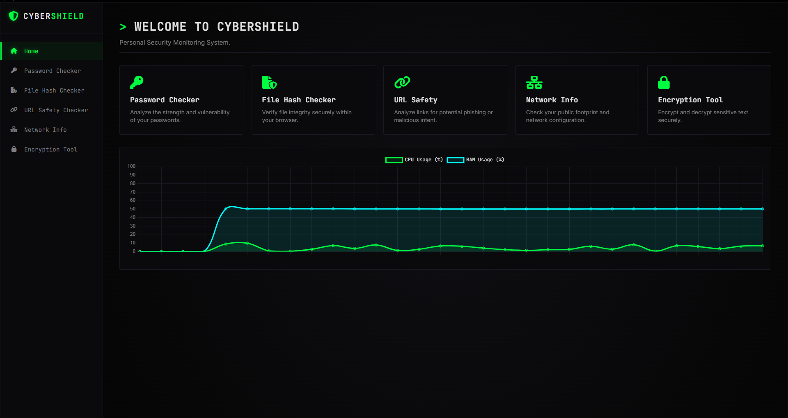

# CyberShield – Personal Security Monitoring System

<div align="center">
  
  
  
</div>

<br/>

**CyberShield** is a comprehensive, cross-platform desktop application built with Electron and Node.js. It provides a centralized suite of essential cybersecurity utilities packaged in a premium, live-updating dashboard environment.

## 🎯 Purpose & Vision
CyberShield was developed to demonstrate the practical application of systems-level programming and applied cryptography in a modern JavaScript/Node.js stack. By bypassing browser restrictions via Electron's IPC bridge, the application securely interacts directly with the host operating system to provide real-time monitoring and cryptographic integrity checks.

---

## 📸 Dashboard



---

## 🚀 Key Features

*   **📊 Live System Telemetry**: Utilizes the Node.js `os` module and `Chart.js` to render a beautiful, real-time scrolling graph of your machine's CPU and RAM usage.
*   **🔐 Password Leak Checker (k-anonymity)**: Evaluates password entropy and securely checks the *Have I Been Pwned* API by hashing the password locally (SHA-1) and only transmitting the first 5 characters (k-anonymity model) to ensure absolute cryptographic privacy.
*   **🛡️ File Integrity Monitor**: Bypasses browser memory limitations by utilizing native `crypto.createHash` streams. Rapidly calculates SHA-256, SHA-1, and MD5 hashes and allows for expected-hash comparison with visual Red/Green tamper alerts.
*   **📡 Network Diagnostics Engine**: Interfaces directly with the OS `child_process` to execute local ICMP ping sweeps and enumerate network interfaces (`os.networkInterfaces()`).
*   **🔒 Authenticated AES-256-GCM Encryption**: Implements symmetric encryption (Galois/Counter Mode) with secure key derivation (`pbkdf2Sync` with 100,000 iterations) and cryptographically secure random IVs.
*   **🚨 Alert System**: Features a globally integrated Red (Critical), Yellow (Warning), and Green (Secure) badge alerting system across all modules.

---

## 🛠️ Installation & Usage (How to Run)

Because this is a modern Node.js application, the industry standard `package.json` replaces legacy `requirements.txt` files.

### Prerequisites
*   [Node.js](https://nodejs.org/) (v16.x or higher)
*   npm (Node Package Manager)

### Setup Instructions

```bash
# 1. Clone the repository
git clone https://github.com/quietdom/cybersecurity-dashboard

# 2. Navigate into the project directory
cd cybersecurity-dashboard

# 3. Install all dependencies (Electron, Chart.js, etc.)
npm install

# 4. Launch the application
npm start
```

## 🔒 Security Architecture
CyberShield employs strict Inter-Process Communication (IPC) via Electron's `contextBridge` to securely isolate the Chromium rendering engine from raw Node.js system APIs, ensuring a secure desktop environment resistant to cross-site scripting (XSS) payload escalation.
